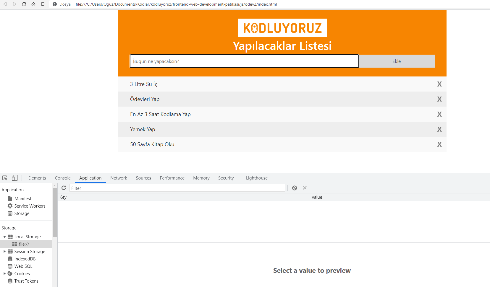
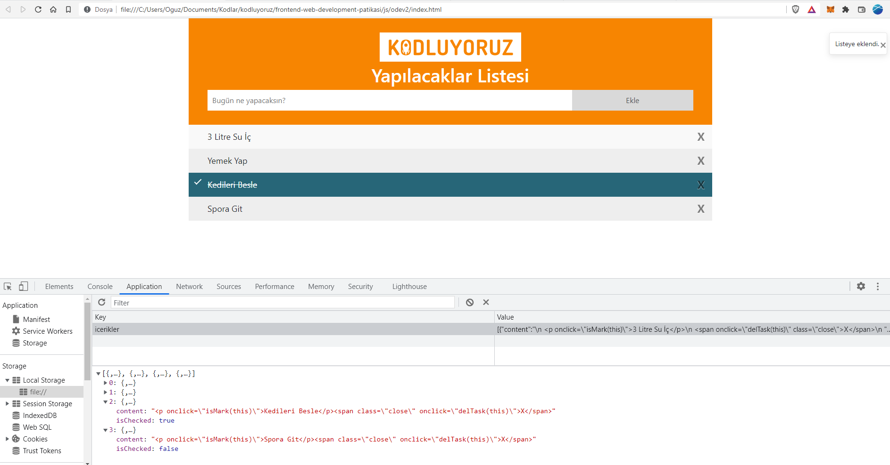

# Javascript Ödev 2

To Do App made with Vanilla Javascript

## Features

* Add Function for new to-do tasks
* Delete Function
* Mark up Function
* Local Storage usage for data saving
* Basic input control and Bootstrap toast notification
* Vanilla Javascript

## Screenshots

***Initial State***

***Adding new task - Local Storage details***
